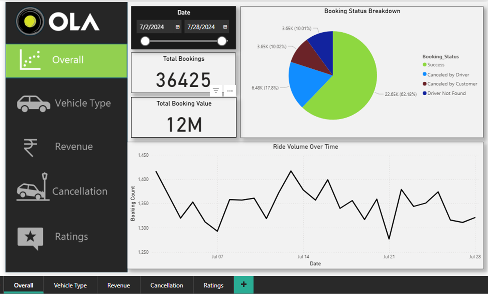

# Ola Ride Booking & Cancellation Analysis — SQL + Power Bi End-to-End Project

## 📌 Project Overview  

This project presents an end-to-end data analysis of Ola ride bookings with a
focus on understanding customer and driver-led cancellations. The objective
is to identify key cancellation drivers, evaluate booking and revenue trends,
and provide data-backed insights to improve operational efficiency and
customer experience.

---

## 🎯 Business Objectives
- Maintain customer cancellation rate below **7%**
- Keep driver cancellation rate below **18%**
- Limit incomplete rides to under **6%**
- Increase weekend order volume and total booking value
- Evaluate vehicle-wise performance, revenue contribution, and ratings

---

## 🛠 Tools & Technologies
- **Excel** – Data cleaning, preprocessing, and validation  
- **SQL** – Exploratory analysis and business-focused queries  
- **Power BI** – Interactive dashboards and KPI visualization  

---

## 📊 Power BI Dashboards

### 1️⃣ Overall Performance Dashboard  
Tracks total bookings, booking value, ride trends, and booking success rate.  
👉 

### 2️⃣ Vehicle Type Analysis Dashboard  
Compares booking value, success rate, and distance traveled across vehicle types.  
👉 

### 3️⃣ Revenue Analysis Dashboard  
Analyzes revenue trends, payment methods, and top customers.  
👉 

### 4️⃣ Cancellation Analysis Dashboard  
Identifies cancellation reasons from both customer and driver perspectives.  
👉 

### 5️⃣ Ratings Analysis Dashboard  
Evaluates driver and customer ratings across different vehicle categories.  
👉 

---

## 🧠 SQL Analysis – Business Questions Solved Using Data

SQL was used to analyze booking patterns, cancellation behavior, revenue
performance, and service quality across Ola ride data.

### ✅ Key Business Questions Addressed Through SQL

1️⃣ 📊 What is the overall ride booking success rate?  

2️⃣ 🚫 How are ride cancellations distributed between customers and drivers?  

3️⃣ 🚗 Which vehicle categories experience the highest cancellation rates?  

4️⃣ 💳 Does the payment method influence ride completion and cancellation?  

5️⃣ ⏰ What are the peak booking hours during the day?  

6️⃣ 📆 How does weekend demand compare with weekday demand?  

7️⃣ 💰 Which vehicle types contribute the most to total revenue?  

8️⃣ 📏 What is the average trip distance and fare by vehicle category?  

9️⃣ ⭐ How do driver and customer ratings vary across vehicle segments?  

🔟 ❗ What percentage of total bookings result in incomplete rides?

📂 **Complete SQL Queries & Analysis**  
👉 `sql/Ola_data_queries.sql`

---

## 🔍 Key Insights
- Driver-initiated cancellations contribute a major share of booking failures  
- Weekend demand shows strong potential for higher bookings and revenue  
- Certain vehicle categories consistently outperform others in distance and ratings  
- Digital payment methods (UPI, card) are associated with better ride completion rates  

---

## ✅ Business Recommendations
- Introduce driver-level cancellation incentives and penalties  
- Promote high-performing vehicle categories during peak hours  
- Strengthen digital payment adoption to reduce ride friction  
- Optimize weekend pricing and availability strategies  

---

## 📁 Repository Structure

---

## ✅ Conclusion
This project demonstrates an end-to-end analytics workflow using Excel, SQL,
and Power BI to solve a real-world business problem. The insights generated can
support data-driven decision-making to reduce cancellations, improve ride
success rates, and enhance overall platform performance.
